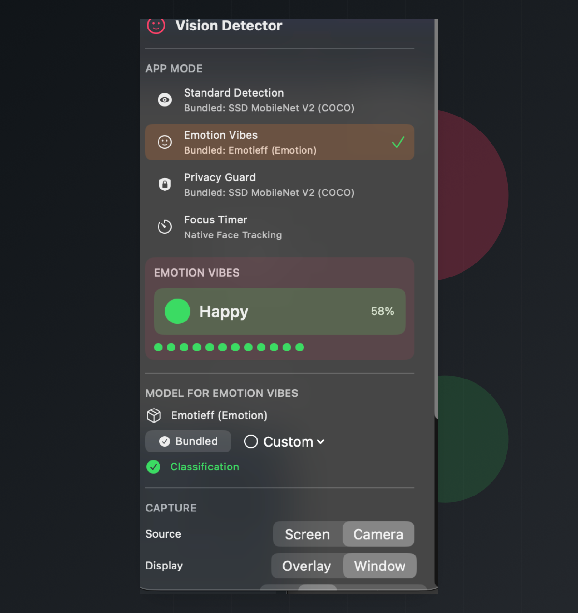
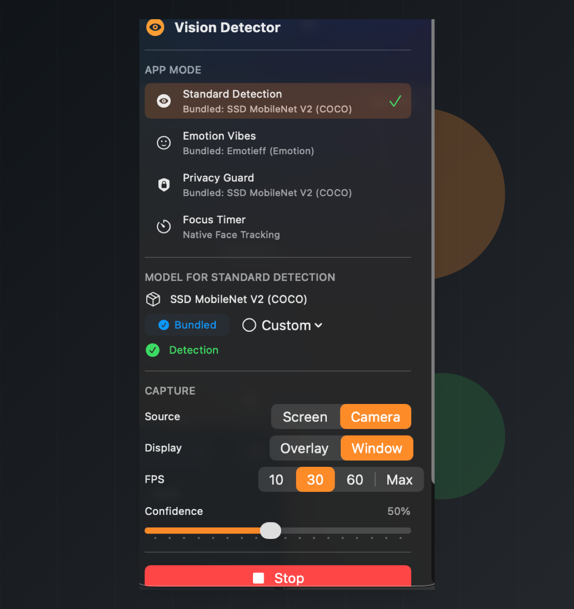
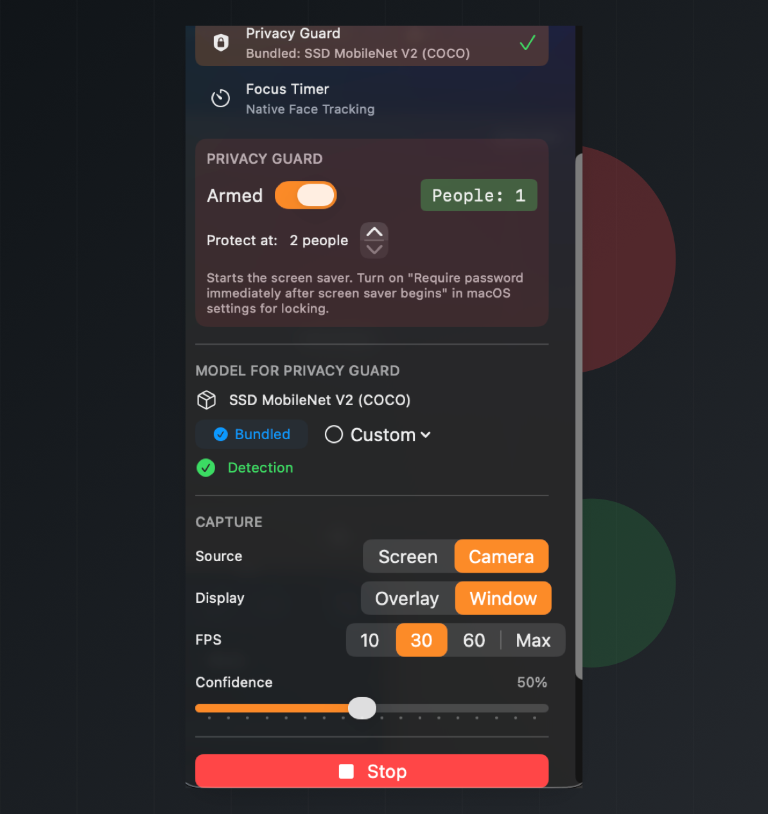

# Mac Vision Tools

Mac Vision Tools is a macOS menu bar app for real-time, on-device computer vision. It can run object detection, emotion classification, privacy monitoring, and focus tracking from either the camera or the screen.

The app is designed for quick experiments with Core ML and Vision models while keeping capture and inference local to the Mac.

<p align="center">
  
  
  
</p>

## Features

| Mode | What it does | Model or framework |
| --- | --- | --- |
| Standard Detection | Runs object detection and draws labeled boxes over a window or overlay. | SSD MobileNet V2 |
| Emotion Vibes | Detects faces, classifies the visible emotion, and tracks recent emotion history. | Emotieff plus Apple Vision face detection |
| Privacy Guard | Counts visible people and starts the screen saver when the threshold is reached. | SSD MobileNet V2 |
| Focus Timer | Tracks head pose and counts focused time toward a target session. | Apple Vision face landmarks |

## Recent Logic Fixes

The current repo includes fixes for several app lifecycle issues:

| Area | Fix |
| --- | --- |
| Model switching | Loading a new model now clears the previous model state and ignores stale async load results. |
| Capture startup | Camera or screen startup failures now reset the running state instead of leaving the app stuck as active. |
| Focus timer | Focus time now updates while the user remains focused, not only when focus changes or the session stops. |
| Face classification crop | Emotion face crops are clamped to the source image bounds before classification. |

## Requirements

- macOS 14 or later recommended
- Xcode 15 or later
- A Mac with camera access for camera-based modes
- Screen Recording permission for screen capture
- Camera permission for camera capture, emotion mode, and focus mode

## Build From Source

1. Open `src/MacVisionTools.xcodeproj` in Xcode.
2. Select the `MacVisionTools` scheme.
3. Build and run the `MacVisionTools` target.
4. Grant macOS permissions when prompted.

Command-line build:

```sh
xcodebuild -project src/MacVisionTools.xcodeproj -scheme MacVisionTools -configuration Debug build
```

If Xcode cannot write DerivedData in your user Library from a sandboxed terminal, build with an explicit derived data path:

```sh
xcodebuild -project src/MacVisionTools.xcodeproj -scheme MacVisionTools -configuration Debug -derivedDataPath /tmp/MacVisionToolsDerivedData build
```

## Mac App Store Readiness

The App Store-oriented build is sandboxed and avoids network access. The app uses only the camera and user-selected file entitlements, and custom Core ML model selections are stored with security-scoped bookmarks so they continue to work after relaunch.

Before submitting, deploy the landing page so the privacy policy URL is public, archive with Mac App Store distribution signing, and complete the manual permission test pass. See `docs/app-store-submission.md`.

## Install A Release

1. Download the latest app from the repo's Releases page.
2. Move `MacVisionTools.app` to `/Applications`.
3. Open the app. If Gatekeeper blocks it, use System Settings to allow it.
4. Grant Camera and/or Screen Recording permission depending on the capture source you want to use.

## Usage

The app runs from the macOS menu bar. Open the menu bar panel, choose a mode, choose a capture source, and press Start.

| Control | Options |
| --- | --- |
| Source | Camera or Screen |
| Display | Window or Overlay |
| FPS | 10, 30, 60, or Max |
| Confidence | Adjustable model confidence threshold |
| Model | Bundled model or custom Core ML model |

## Models

| Model | Task | Source |
| --- | --- | --- |
| SSD MobileNet V2 | Object detection | [TensorFlow Models](https://github.com/tensorflow/models) |
| Emotieff | Emotion recognition | [EmotiEff](https://github.com/sb-ai-lab/EmotiEffLib/blob/main/models/affectnet_emotions/mobilenet_7.h5) |
| Apple Vision | Face detection and landmarks | [Apple Vision documentation](https://developer.apple.com/documentation/vision) |

Bundled models live under `src/Models`. Custom models can be selected from the app panel as `.mlmodel`, `.mlpackage`, or `.mlmodelc` files.

The bundled SSD MobileNet model is exported with raw detector outputs and postprocessed in Swift. To regenerate it, see `docs/model-replacement.md`.

## Privacy Notes

- Inference runs locally through Core ML and Vision.
- Camera and screen frames are used for live detection and are not saved by the app.
- The app does not create accounts, run analytics, track users, or send camera or screen content to a server.
- Privacy Guard starts the screen saver when the configured person threshold is reached. For a true lock, enable macOS's setting to require a password immediately after screen saver begins.

## Landing Page

A static landing page is included in `website/`. Open `website/index.html` directly in a browser, or deploy the folder to GitHub Pages, Netlify, Vercel, or any static host.

For Cloudflare Pages, the repository also includes a root `index.html`, so the default static deploy works from the repo root. Use no build command and `/` as the output directory.

## Repo Structure

| Path | Purpose |
| --- | --- |
| `src/MacVisionTools.swift` | App entry point and menu bar setup |
| `src/DetectionManager.swift` | Capture, model loading, inference, and FPS state |
| `src/Models.swift` | App modes, state objects, model path storage, and privacy/focus logic |
| `src/ControlPanelView.swift` | Menu bar control panel UI |
| `src/Views.swift` | Mode-specific SwiftUI panels |
| `src/Windows.swift` | Overlay and detection preview windows |
| `images/` | README and landing-page screenshots |
| `website/` | Static landing page |

## Troubleshooting

| Problem | What to check |
| --- | --- |
| Start button is disabled | Load a model, or switch to Focus Timer, which uses native Vision tracking. |
| Screen capture fails | Enable Screen Recording for the app in System Settings, then restart the app. |
| Camera capture fails | Enable Camera permission and check that no other app is exclusively using the camera. |
| No detections appear | Lower the confidence threshold, verify the correct model is loaded, and try the window display mode first. |
| Privacy Guard does not lock | Confirm the mode is armed, the person threshold is reached, and macOS is set to require a password immediately after the screen saver begins. |

## License

This project is licensed under the Apache License 2.0. See [LICENSE](LICENSE) for details.

For third-party model licenses and acknowledgments, see [CREDITS.md](CREDITS.md).
